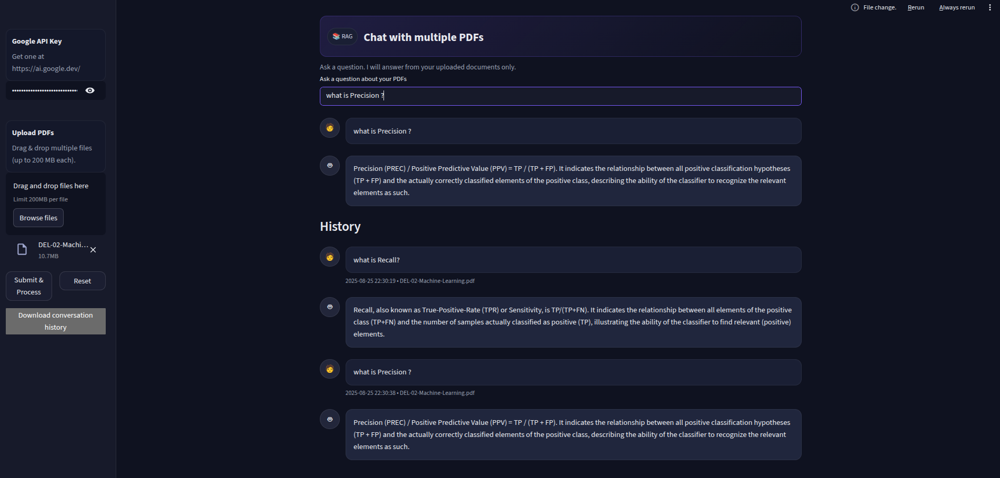

# RAG-Based-PDF-Chatbot-with-LangChain-Gemini-API
A Streamlit web app that lets you **chat with your PDFs** using **Retrieval-Augmented Generation (RAG)**.  
Upload one or more PDF documents, ask natural language questions, and get context-aware answers directly from your files — powered by **Google Gemini** and **FAISS**.




---

##  Features
-  Extracts and chunks text from uploaded PDFs  
-  Builds embeddings with **Google Generative AI** (`models/embedding-001`)  
-  Stores embeddings in a local **FAISS vector store**  
-  Answers your questions using **Gemini (gemini-2.5-flash)**  
-  Maintains conversation history with timestamps and source PDFs  
-  Export conversation history as a CSV file  
-  Professional dark UI with styled chat bubbles  

---

##  Getting Started

### 1. Clone the repository
```bash
git clone https://github.com/minhazriyam/RAG-Based-PDF-Chatbot-with-LangChain-Gemini-API.git
```

### 2. Create and activate a virtual environment
```bash
python3 -m venv myvenv
source myvenv/bin/activate   # Linux / macOS
myvenv\Scripts\activate      # Windows
```

### 3. Install dependencies
```bash
pip install -r requirements.txt
```

### 4. Get a Google API Key
* Visit [Google AI Studio](https://aistudio.google.com)
* Create an API key
* Keep it ready for the app sidebar input

### 5. Run the app
```bash
streamlit run app.py
```

## Contributing
Pull requests are welcome! For major changes, please open an issue first to discuss.

## License

This project is licensed under the MIT License.
